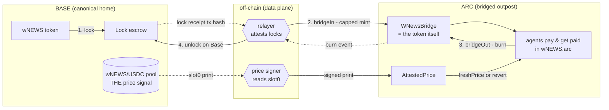
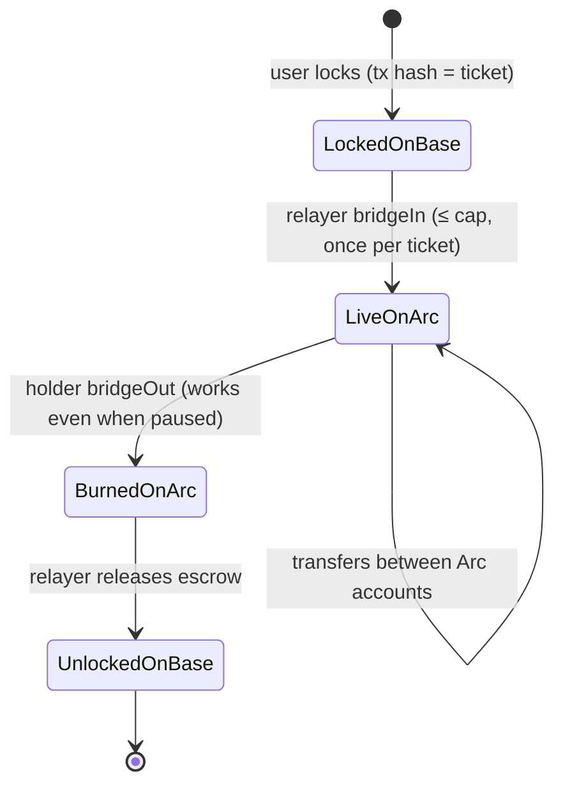

# Bridge map — wNEWS: Base ⇄ Arc

The whole system, literally and code-wise. Written to be handed to a
designer: every numbered step below is a scene, and the **user should
never be unsure which step their tokens are in.**

## The two lanes

There are two independent one-way-glass lanes. Tokens move in lane 1.
Only *information* moves in lane 2 — never value.

**Lane 1 (value):** lock on Base → mint on Arc → burn on Arc → unlock
on Base. Nothing is ever created from air: Arc supply IS the locked
amount, enforced by construction (the token contract is the bridge).

**Lane 2 (information):** the canonical Base pool's price reaches Arc as
a *signed report*, not a market. There is deliberately NO Arc-side pool —
one price signal, many venues.

## Step-by-step, with code anchors

| # | Step | Who acts | Code | What the user sees |
|---|------|----------|------|--------------------|
| 1 | **Lock on Base** — send wNEWS to the lock escrow | user | Base-side locker (see "unbuilt piece" below) | wNEWS leaves their Base wallet; they keep the tx hash — that hash IS their claim ticket |
| 2 | **Mint on Arc** — relayer attests the lock | relayer only | [`bridgeIn` — WNewsBridge.sol L80](../contracts/WNewsBridge.sol#L80), emits `BridgedIn(to, amount, baseLockTx)` L68 | wNEWS.arc appears at their Arc address; the `BridgedIn` event names their Base lock tx — a 1:1 receipt |
| 3 | **Use on Arc** — normal ERC20 | anyone | `transfer`/`approve` (standard) | agents pay and get paid; balances move like any token |
| 4 | **Burn to exit** — leave Arc anytime | any holder | [`bridgeOut` — WNewsBridge.sol L98](../contracts/WNewsBridge.sol#L98), emits `BridgedOut(from, amount, baseRecipient)` L71 | tokens burn on Arc; they name their Base recipient in the same call |
| 5 | **Unlock on Base** | relayer watches `BridgedOut` | Base-side locker releases | wNEWS back in the named Base wallet |
| P | **Price arrives** (continuous) | anyone can relay; only the signer's signature counts | [`post` — AttestedPrice.sol L39](../contracts/AttestedPrice.sol#L39) → `PricePosted` L23; consumers call [`freshPrice` L58](../contracts/AttestedPrice.sol#L58) | Arc apps show the Base pool's price, at most 2h old — or an explicit "stale" error, never a silently old number |

## The three safety facts (make these LOUD)

1. **The cap is the blast radius.** [`MINT_CAP = 100_000e18` — L26](../contracts/WNewsBridge.sol#L26).
   Total Arc supply can never exceed it, no matter who is compromised.
   The admin *cannot raise it* (constant) — only a redeploy (new
   contract, new decision) changes it. Visual: a gauge that physically
   cannot go past its end stop.
2. **Pause stops inflows, never exits.** [`setPaused` — L107](../contracts/WNewsBridge.sol#L107)
   gates `bridgeIn` only; [`bridgeOut` L98](../contracts/WNewsBridge.sol#L98)
   deliberately has no pause check. Emergency = the drawbridge goes up,
   but everyone inside can always leave. Visual: entry gate closes, exit
   gate welded open.
3. **Every mint is a receipt, and no receipt spends twice.** `bridgeIn`
   is idempotent per Base lock tx (`processed[baseLockTx]`) and
   relayer-only. Visual: each Base lock stamps one ticket; a used ticket
   visibly voids.

## State machine (per token batch)

Invariant to display on any dashboard, at all times:
`Arc totalSupply == Base locked balance`, and both `≤ MINT_CAP`.

## Roles (keys ≠ powers)

| Key | Power | Cannot |
|---|---|---|
| **admin** (hardware-backed, immutable address) | pause inflows; rotate relayer | raise cap; mint; take funds; block exits |
| **relayer** (data-plane) | mint against real lock receipts, up to cap | exceed cap; mint a receipt twice; change anything |
| **price signer** (data-plane) | make a price print valid | move any funds; sign backwards (prints are monotonic) |
| **any holder** | exit via `bridgeOut`, always | be trapped by a pause |

## The one unbuilt piece

The **Base-side locker**. Two options, decision pending:

- *Minimal:* designated escrow (Safe) address; relayer watches wNEWS
  `Transfer`s to it; Arc recipient defaults to the sender's address.
- *Cleaner (~30 lines, recommended):* tiny `BaseLocker` contract with
  `lockFor(arcRecipient, amount)` emitting `Locked(sender, arcRecipient,
  amount)` — lets a user lock from one wallet and receive on Arc at
  another, and gives the relayer a purpose-built event to watch.

Everything Arc-side is built, Slither-clean, and compiles.

## Animation storyboard (handoff to Claude Design)

Five scenes, in order of importance:

1. **The ticket journey** — a wNEWS coin drops into the Base vault, a
   ticket (tx hash) prints, the ticket crosses to Arc, one coin materializes
   there, the ticket visibly voids. Re-presenting the void ticket bounces.
2. **The gauge with an end stop** — mints fill a 100K gauge; when full,
   further mints bounce off the physical stop. Label: "worst case, priced."
3. **The drawbridge** — pause raises the entry bridge; the exit door
   stays welded open and coins keep leaving. Label: "you can always exit."
4. **One signal, many venues** — the Base pool beats like a heart; each
   beat emits a signed pulse that Arc displays. An imposter pulse without
   the signature shatters on arrival. A pulse older than 2h greys out and
   apps refuse it loudly.
5. **Keys as shaped holes** — admin/relayer/signer keys each fit only
   their own keyhole; show the admin key failing to fit the "raise cap"
   hole (there isn't one).
